# Restaurant Menu's Nutrition Parsing Service

This Python service accepts various types of URLs (web, resource, or local file paths), downloads the content if necessary, parses it using LlamaParse, and outputs structured JSON data.

## Features
- Handles web URLs, image/PDF resources, and local file paths.
- Utilizes LlamaParse for parsing and extracting structured information.
- Merges JSON outputs into a single structured file.
- Outputs the final JSON file to a specified directory.

## Prerequisites
- Python 3.12
- Internet connection for downloading packages and accessing APIs.

## Setup Instructions

Follow these steps to set up and run the service:

1. **Download Python 3.12**:
   - Ensure you have Python 3.12 installed on your system. You can download it from the [official Python website](https://www.python.org/downloads/).

2. **Create a Virtual Environment**:
   ```bash
   python3 -m venv venv

This command creates a virtual environment named venv.
Activate the Virtual Environment:

## On Windows:

```
   venv\Scripts\activate
```

## On macOS/Linux:
```bash
    source venv/bin/activate
```
## Install Required Packages:

**Navigate to the root directory of the project and run:**
```bash
     pip3 install -r requirements.txt
```
## Set Up Environment Variables:

**Create a `.env` file in the root directory and add the following lines, replacing `<LLAMA_CLOUD_API_KEY>` and` <OPENAI_API_KEY> `with your actual API keys:**

**Paste your Llama cloud & OPENAI key**
- Get one from for llamaCloud: https://cloud.llamaindex.ai/login
- For OpenAI API Key, use https://platform.openai.com/

```dotenv
LLAMA_CLOUD_API_KEY=<YOUR_LLAMA_CLOUD_API_KEY>
OPENAI_API_KEY=<YOUR_OPENAI_API_KEY>

```

## Run the Service:

**Use the following command to start the service, replacing `<RESOURCE_URL/FILE_PATH/WEB_URL>` with the actual URL or file path you wish to process:**

```bash
     python3 -m src.main -f <RESOURCE_URL/FILE_PATH/WEB_URL>
```
## Check Output:

***Once the service has finished processing, the output will be available at: `/src/outputs/restaurant_menu_nutrition_info.json` by default***

**there is already one output available for the command :-**
```bash
    python3 -m src.main -f https://bensfastfood.com/nutrition
```
## Notes
`
Ensure that the provided URL or file path is accessible.
The service may take some time to process larger files or complex web pages.
`

# Improvements scope & Scaling Opportunity:-
**These are few steps which we can use to further strengthen the correctness of this system**
- Write a more strict deep merge algorithm while collecting json objects from stream response. 
- Few parsing steps can be parallelized to speed up the system overall run time. 
- In this system, we are first downloading and then parsing file/content at once, we can write/configure chunking strategy to improve memory uses. 
- I have used LlamaParse to parse pdf/image containing tables. This parsing can be configured to perform more powerful parsing for complex pdfs by tuning some parameters. (Need some research on this)
- To scale the system to support more format, we can simply configure our LlamaParse to accept that format or use any reader and convert it into LlamaParse Document object which seamlessly integrate in current system.

# System Design Flow 

## System Design of the current service 
